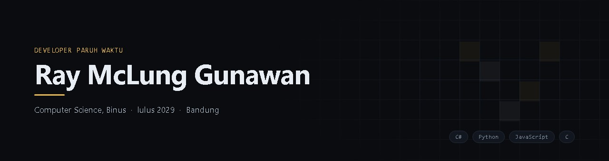
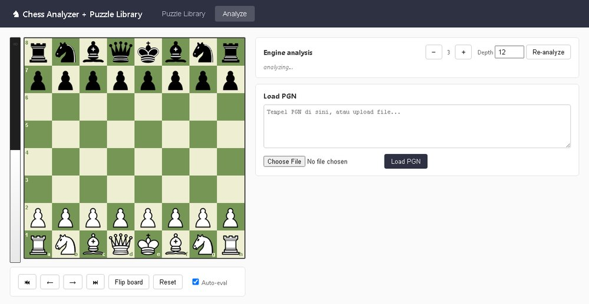
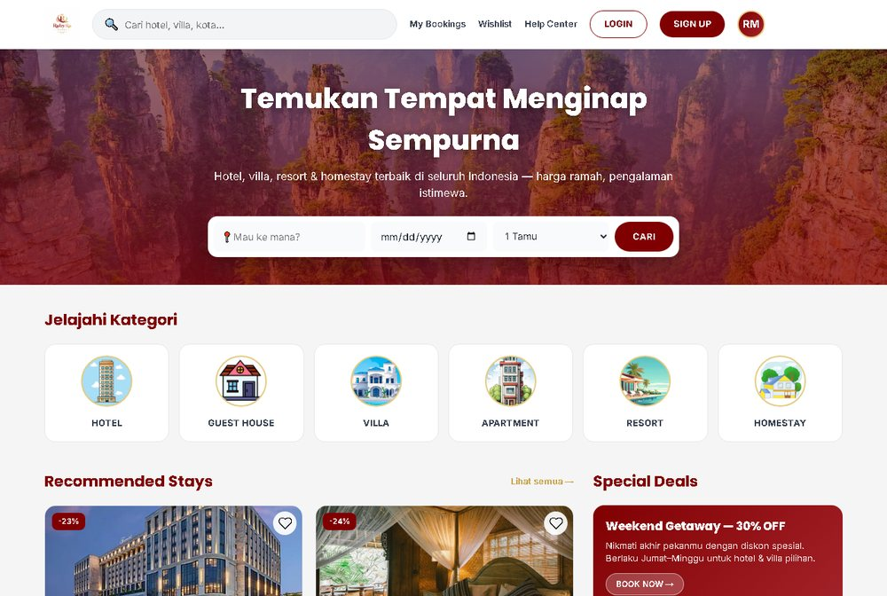
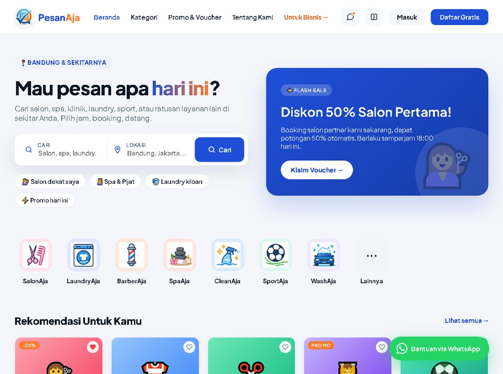

<div align="center">


<a href="https://raymclung.github.io"></a>
<a href="https://www.linkedin.com/in/raymclunggunawan/"></a>
<a href="mailto:raymclung@gmail.com"></a>

</div>

<br>

## 👋 Halo

Saya mahasiswa Computer Science di Binus, Bandung, sekaligus developer paruh waktu. Hampir
semua yang saya bangun berhubungan dengan catur, bukan karena direncanakan, tapi karena dari
sanalah tugas-tugas pertama saya datang: bot moderasi grup, pembangkit puzzle, penulis artikel.
Saya cenderung memulai tanpa framework, bukan karena anti, tapi karena ingin tahu dulu apa yang
sebenarnya terjadi sebelum menyerahkannya ke pustaka orang lain. Belakangan sedang belajar C
dan Python.

<br>

## 🧰 Yang saya pakai

<div align="center">


</div>

<br>

## 📌 Yang saya kerjakan

## 🤖 wa-bot-grup-catur

Bot moderasi grup WhatsApp untuk komunitas catur. Berjalan sejak Juni 2026.

```
WhatsApp ⇄ gateway (Node.js) ──POST /incoming──▶ brain (C# .NET 10)
                  ▲                                      │
                  └──── POST /delete , POST /send ◀───────┘
```

<sub>[Kode](https://github.com/raymclung/wa-bot-grup-catur) &nbsp;·&nbsp; C#, .NET 10, Node.js, Baileys</sub>

Gateway hanya mengurus koneksi; seluruh logika moderasi ada di brain. Dengan begitu aturannya
bisa diuji tanpa perlu terhubung ke WhatsApp sama sekali.

Yang paling banyak mengajari saya justru bukan kodenya, melainkan WhatsApp itu sendiri. Bot
ini pernah kena blokir 403 karena mengirim terlalu banyak pesan, jadi saya tambahkan batas 50
pesan per jam, ubah jawaban puzzle dari gambar papan menjadi teks, dan buat jeda sambung-ulang
yang makin lama makin panjang. Ada juga mode "capek" dan jam tenang pukul 1–5 pagi.

<br>

## ♟️ PGN to Puzzle

<a href="https://github.com/raymclung/PGN-to-puzzles-Chess">
  
</a>

```
$ python pgn_to_puzzles.py sample12.pgn --depth 10 -o puzzles.json

  [  3] L5  ply 42  c7c5 -> Qxh6 Rf7 Rxg7+ Rxg7 Bc4+ d5 Rxd5 Qxd5 Bxd5+ Kf8
  [  5] L4  ply 59  d6g6 -> Bxc2+ Ke3 Bd4#
  [  6] L3  ply 23  g5e4 -> Nxe4 Nxe4 Qxe4 c3
  ...
  Wrote 16 puzzles -> puzzles.json
```

<sub>[Kode](https://github.com/raymclung/PGN-to-puzzles-Chess) &nbsp;·&nbsp; Python, Stockfish</sub>

Membaca partai catur, mencari langkah yang mengubah posisi seimbang menjadi kalah, lalu
menjadikannya puzzle. Ada 26 tema taktis yang dikenali, termasuk pola mat bernama seperti
*smothered* dan *Anastasia*. Semuanya ditulis dari nol tanpa pustaka tambahan.

Bagian yang paling lama saya pikirkan adalah cara menentukan tingkat kesulitan. Awalnya saya
pakai panjang solusi, tapi itu keliru: rangkaian panjang berisi langkah gamblang tetap mudah,
sementara satu langkah tenang yang brilian tetap sulit.

Ada juga papan analisa berbasis web untuk menelaah satu partai langkah demi langkah, dengan
evaluasi mesin di tiap posisi.

<br>

## 📝 PGN to Article

```
$ pgn-to-article partai.pgn --lang id -o artikel.md

  [1/4] Parsed 153 half-moves
  [2/4] Running engine analysis...
  [3/4] Prompt built — 2,121 characters
  [4/4] Asking ollama...
        done — 1,708 characters written
```

<sub>[Kode](https://github.com/raymclung/PGN-to-article) &nbsp;·&nbsp; C#, .NET 10, Stockfish</sub>

Membaca satu partai, menandai momen kritisnya dengan Stockfish, lalu menuliskannya jadi
artikel. Bagian yang menentukan ada di penyusun prompt: ia tidak menempelkan notasi partai
begitu saja, tapi merangkai konteks: siapa pemainnya, pembukaan apa, di langkah mana posisi
berubah, dan seberapa besar perubahannya menurut mesin.

Alat ini saya pisahkan dari sistem yang lebih besar, sekaligus dipindahkan dari .NET Framework
ke .NET 10. `JavaScriptSerializer` diganti `System.Text.Json` lewat lapisan kompatibilitas yang
mempertahankan bentuk data lama, sehingga 2.000 baris kode di bawahnya tidak perlu disentuh.

<br>

## 🏨 RubyRa Stays

<a href="https://raymclung.github.io/RubyRa/">
  
</a>

<sub>[Coba demonya](https://raymclung.github.io/RubyRa/) &nbsp;·&nbsp; [Kode](https://github.com/raymclung/RubyRa) &nbsp;·&nbsp; JavaScript, CSS</sub>

Tugas kuliah. Prototipe pemesanan penginapan dengan tiga belas layar dan 53 fungsi JavaScript,
seluruhnya dalam satu berkas HTML tanpa dependensi.

Versi pertamanya berukuran **31,6 MB** karena semua gambar saya tanam sebagai base64. Satu
barisnya saja 25 MB, dan GitHub menolaknya saat diunggah. Setelah gambarnya dikeluarkan jadi
berkas terpisah lalu dikompres, tinggal 2,7 MB. Ternyata dari 37 gambar yang tertanam, cuma
19 yang benar-benar berbeda.

<br>

## 📅 PesanAja

<a href="https://raymclung.github.io/Pesan-Aja/">
  
</a>

<sub>[Coba demonya](https://raymclung.github.io/Pesan-Aja/) &nbsp;·&nbsp; [Kode](https://github.com/raymclung/Pesan-Aja) &nbsp;·&nbsp; JavaScript, PWA</sub>

Tugas kuliah juga. Prototipe pemesanan layanan seperti salon, spa, laundry, dan barbershop.
Dua puluh halaman yang saling terhubung, mobile-first dengan tata letak desktop tersendiri,
dan bisa dipasang sebagai PWA lewat service worker.

Tiap halaman punya blok `<style>` sendiri, dan lama saya kira itu banyak pengulangan.
Setelah diukur ternyata cuma 2% yang benar-benar duplikat. Sisanya memang khusus per
halaman. Yang akhirnya saya satukan hanya 37 token desain ke satu berkas.

<br>

---

<div align="center">


<br><br>

**Terbuka untuk magang dan proyek lepas.**

<sub>Sapa saja lewat <a href="https://www.linkedin.com/in/raymclunggunawan/">LinkedIn</a> atau <a href="mailto:raymclung@gmail.com">email</a>.</sub>

<br>


</div>
